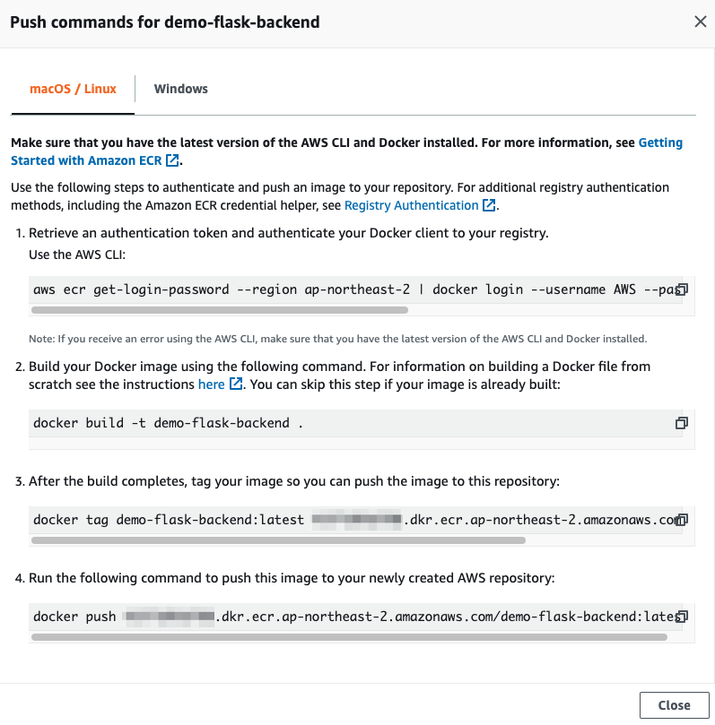

# Building Containers
In here we are going to build the Python code present here and push it to a container registry - the Amazon Elastic Container Registry (ECR).

1. Create a container registry in ECR using the AWS CLI with these commands:
```bash
aws ecr create-repository \
  --repository-name demo-flask-backend \
  --image-scanning-configuration scanOnPush=true \
  --region ${AWS_REGION}
```

After pushing this code, go to the AWS ECR Console to check whether the action has been properly served.

The repo has code that we can use to continually connect to and push code into the repo we have just created.


2. To push the container image to the repository, bring the authentication token and pass the authentication to the docker login command. At this point, we specify the user name as AWS and specify the Amazon ECR registry URI that we want to authenticate with.
```bash
aws ecr get-login-password --region ${AWS_REGION} | docker login --username AWS --password-stdin $AWS_ACCOUNT_ID.dkr.ecr.$AWS_REGION.amazonaws.com
```

3. Specify the location for the code we will be packaging and pushing to ECR, and build the Docker image
```bash
cd ~/code

docker build -t demo-backend-flask .
```

4. When the image has been built, tag the image so that it'd be easier to push it to the repo we have created in ECR
```bash
docker tag demo-flask-backend:latest $AWS_ACCOUNT_ID.dkr.ecr.$AWS_REGION.amazonaws.com/demo-flask-backend:latest
```

5. Push the image to ECR with this command
```bash
docker push $ACCOUNT_ID.dkr.ecr.$AWS_REGION.amazonaws.com/demo-flask-backend:latest
```

6. Go to the ECR console to confirm that the image we have created has been pushed into our repo

After this, we have successfully created an ECR repo and pushed code into it that will be used by our EKS cluster later.