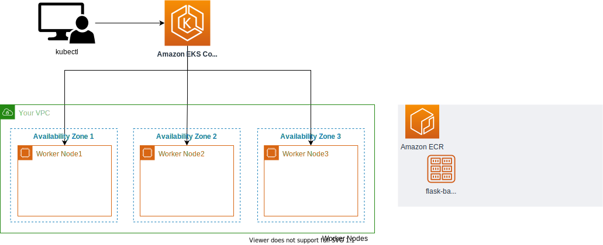

# Firing Up the Amazon EKS Cluster
In this session, we are going to set up the EKS cluster with our own configuration to save up on cost whilst getting the most value.

I have opted to go for the t3.medium EC2 instance type to power the nodes in our EKS cluster. Feel free to use any other but this is the ideal one with a good balance of compute, memory, and network resources.

1. The configuration for the cluster is in the `eks-demo-cluster.yaml`. Peruse and switch configuration as you deem fit.

2. Using the `eksctl` tool, deploy the EKS cluster with the following code
```bash
eksctl create cluster -f eks-demo-cluster.yaml
```
According to sources, the EKS cluster takes at least 15-20 minutes to be fully deployed. Follow up on the status of events and resources in the cluster in the AWS CloudFormation console.

3. When the EKS has been fully deployed, check the node with 
```bash
kubectl get nodes
```
The cluster's credentials can be found in `~/.kube/config`


## Architecture
With all that we have done so far, the Architecture of our project now looks like this
