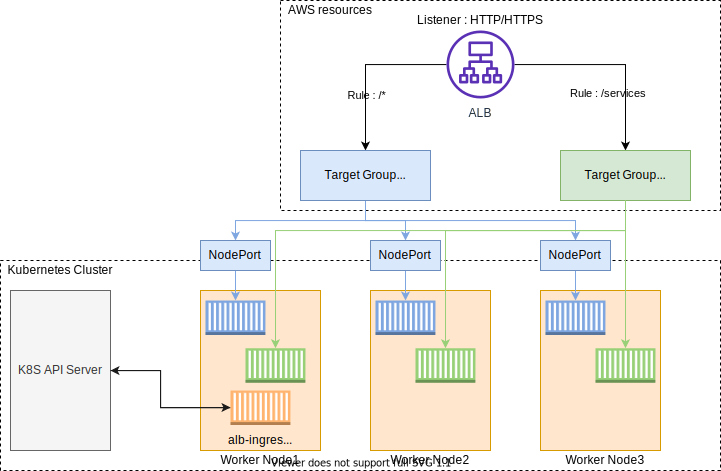

# Creating the AWS Load Balancer Controller
For the EKS cluster created in the previous session, we now have to deploy a LoadBalancer for the cluster so that we can access the Pod data from outside the cluster.

The AWS Load Balancer Controller has been made for that purpose, it manages the Elastic Load Balancers crated for the EKS cluster.
It does the following:
- For Kubernetes Ingress resources, it provisions an Application Load Balancer.
- For Kubernetes Service resources (internal communication), it provisions a Network Load Balancer.

There are two traffic modes supported by the AWS Load Balancer Controller, these are *instance mode* and *IP mode*.
- the *instance mode* is the default mode and it registers all the nodes in the EKS cluster as targets reachable by the LoadBalancer. Traffic in here is routed to a NodePort (in the cluster) and the proxied to the Pods.
- the *IP mode* registers the Pod as the target reachable by the LoadBalancer. The traffic here is routed directly to the Pod. To use this mode, it must be explicitly specified in the Ingress YAML manifest.

Here is an illustration of how the modes work:


Looking back at the diagram, the AWS Load Balancer controller operates over the worker nodes and we must make it accessible to both the AWS ALB and NLB resources through IAM permissions. These IAM permissions can install IAM Roles for the EKS cluster ServiceAccount or can attach directly to existing IAM Roles on the worker nodes.

NB: A **ServiceAccount** provides an identity for processes (applications, system components) that run in a Kuberentes Pod.
- A ServiceAccount is used by application or other Kubernetes components to authenticate with the Kubernetes API Server and other resources.


## Creating IAM Roles/Permissions for ALB/NLB Accessibility to Worker Nodes
1. First, we create an IAM OpenID Connect identity provider for the cluster. This must exist so that objects in the EKS cluster can have IAM Roles that will enable them to have access to AWS resources (via their ServiceAccounts).
```bash
eksctl utils associate-iam-oidc-provider \
  --region ${AWS_REGION} \
  --cluster eks-demo \ # specify name of the eks-cluster 
  --approve
```
- the identity provided can be confirmed via the 'Identity Providers' menu on the IAM console or with the commands below.
- check the OIDC provider URL of the cluster with the commands:
```bash
aws eks describe-cluster --name eks-demo --query "cluster.identity.oidc.issuer" --output text
```
- the result will be in this format:
```bash
https://oidc.eks.ap-northeast-2.amazonaws.com/id/8A6E78112D7F1C4DC352B1B511DD13CF
```
- copy the value after **/id/** and check against the list of providers with the command:
```bash
aws iam list-open-id-connect-providers | grep 8A6E78112D7F1C4DC352B1B511DD13CF
```
- if a result appears, you have successfully created an IAM OIDC identity provider in the EKS cluster. If no response, recreate the IAM OIDC identity provider again.

2. Create an IAM Policy to grant AWS Load Balancer Controller access to the AWS ALB and NLB APIs.
- download the policy with this:
```bash
curl -O https://raw.githubusercontent.com/kubernetes-sigs/aws-load-balancer-controller/v2.5.4/docs/install/iam_policy.json
```
- create the policy with this
```bash
aws iam create-policy \
  --policy-name AWSLoadBalancerControllerIAMPolicy \
  --policy-document file://iam_policy.json
```

3. Create a ServiceAccount for the AWS Load Balancer Controller
```bash
eksctl create iamserviceaccount \
  --cluster eks-demo \
  --namespace kube-system \
  --name aws-load-balancer-controller \
  --attach-policy-arn arn:aws:iam::$AWS_ACCOUNT_ID:policy/AWSLoadBalancerControllerIAMPolicy \
  --override-existing-serviceaccounts \
  --approve
```

References to how this is done can be found [here](https://kubernetes-sigs.github.io/aws-load-balancer-controller/v2.6/deploy/installation/).

Some hands-on labs to practice creating IAM Roles for ServiceAccounts (IRSA) can be found [here](https://repost.aws/knowledge-center/eks-restrict-s3-bucket) too.


## Adding AWS Load Balancer Controller to EKS Cluster
1. First, we install cert-manager - an open-source project that automatically provisions and manages TLS certificates within a Kubernetes cluster.
```bash
kubectl apply -f https://github.com/cert-manager/cert-manager/releases/download/v1.13.1/cert-manager.yaml
```

2. Download the Load Balancer Controller YAML file with this:
```bash
curl -Lo aws_lb_controller.yaml https://github.com/kubernetes-sigs/aws-load-balancer-controller/releases/download/v2.5.4/v2_5_4_full.yaml
```

3. Remove the ServiceAccount section in the `aws_lb_controller.yaml` file with the command below. In doing this, we have ensured that the ServiceAccount we created initially will be the one to be used.
```bash
# deletes lines 596 to 604 of the specified file.
sed -i.bak -e '596,604d' ./aws_lb_controller.yaml
```
- replace the cluster name in the same YAML manifest file with this command:
```bash
sed -i.bak -e 's|your-cluster-name|eks-demo|' ./aws_lb_controller.yaml
```

4. Deploy the AWS Load Balancer Controller YAMLl manifest
```bash
# go into the appropriate directory
kubectl apply -f aws_lb_ingress.yaml
```

5. Download the IngressClass and IngressClassParams YAML manifests to the cluster and apply them.
- download with this command:
```bash
curl -Lo aws_lb_ingressclass.yaml https://github.com/kubernetes-sigs/aws-load-balancer-controller/releases/download/v2.5.4/v2_5_4_ingclass.yaml
```
- apply the YAML manifest with this command:
```bash
kubectl apply -f aws_lb_ingressclass.yaml
```

6. Check whether the deployment of the AWS Load Balancer Controller is successful by running the command below:
```bash
kubectl get deployment -n kube-system aws-load-balancer-controller
```
- in addition, check on the ServiceAccount for the controller too
```bash
kubectl get sa aws-load-balancer-controller -n kube-system -o yaml
```

You can check on the logs generated with this command:
```bash
kubectl logs -n kube-system $(kubectl get po -n kube-system | egrep -o "aws-load-balancer[a-zA-Z0-9-]+")
```

And you can check detailed property values with these commands:
```bash
ALBPOD=$(kubectl get pod -n kube-system | egrep -o "aws-load-balancer[a-zA-Z0-9-]+")

kubectl describe pod -n kube-system ${ALBPOD}
```