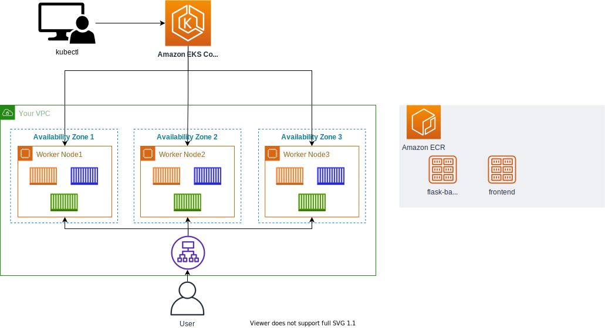
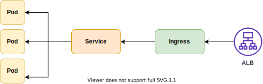
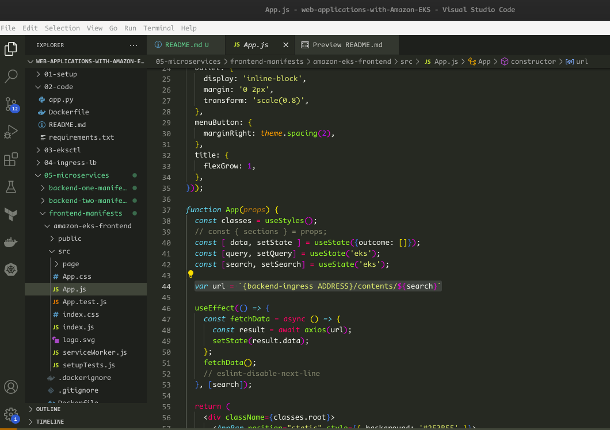
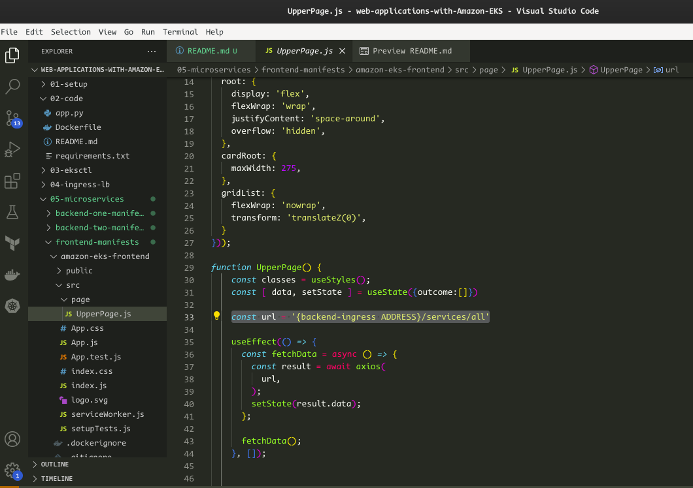

# Deploying Microservices In The EKS Cluster
We are now going to deploy microservices unto our EKS cluster. The microservice architecture thrives on Kubernetes - the benefits of container orchestration, service discovery, load balancing, self-healing and scaling are made available via Kubernetes.

We have three services to make available, 2 backend services and 1 frontend service.
This architecture is what we are going to accomplish



The order in which they will be prepared and deployed is as follows:
- get code from code repository
- create an ECR repo for each service/code's container image
- build container image from code's Dockerfile and push to ECR repo
- create a Deployment, Service and Ingress YAML manifest for each service

The end goal is to make these services available to the end-user who can then access them via the AWS ALB attached to the Ingress of each service.




## Deploying the First Backend Service
If you went through the process of deploying the Python code in the `02-code/README.md` dir, you have already done the creation of an ECR repo, container building and pushing to ECR.

We then proceed with creation of the Deployment, Service and Ingress YAML manifests for this first backend service.

1. go to the `backend-one-manifests` directory and create the Deployment, Service and Ingress manifest files.
2. deploy the created manifests in the order below:
```bash
kubectl apply -f flask-deployment.yaml
kubectl apply -f flask-service.yaml
kubectl apply -f flask-ingress.yaml
```
3. Paste the result of the following command into a web browser to check:
```bash
echo http://$(kubectl get ingress/flask-backend-ingress -o jsonpath='{.status.loadBalancer.ingress[*].hostname}')/contents/aws
```
- it will take some time for the Ingress object to be deployed. Check the Loadbalancer status in the EC2 Console for its activeness.


## Deploying the Second Backend Service
In this second service, we will utilize a public repo that contains a pre-built NodeJS container image.
1. go to the `backend-two-manifests` directory and create the Deployment, Service and Ingress manifest files.
2. deploy the created manifests in the order below:
```bash
kubectl apply -f nodejs-deployment.yaml
kubectl apply -f nodejs-service.yaml
kubectl apply -f nodejs-ingress.yaml
```
3. Paste the result of the following command into a web browser to check:
```bash
echo http://$(kubectl get ingress/nodejs-backend-ingress -o jsonpath='{.status.loadBalancer.ingress[*].hostname}')/services/all
```


## Deploying the Frontend Service
The frontend is a React frontend. The code is in the `amazon-eks-frontend` sub-directory along with the Dockerfile and configuration needed to make it function.

1. Create an ECR repo through the AWS CLI for the frontend.
```bash
aws ecr create-repository \
  --repository-name demo-frontend \
  --image-scanning-configuration scanOnPush=true \
  --region ${AWS_REGION}
```

2. We will make some changes to the code, but it requires that the Ingress of the `flask-backend` and the `nodejs-backend` to be available.
- get the flask-backend with the code below, the result should be placed in the `App.js` file.
```bash
echo http://$(kubectl get ingress/flask-backend-ingress -o jsonpath='{.status.loadBalancer.ingress[*].hostname}')/contents/'${search}'
```

- get the nodejs-backend with the code below, the result should be placed in the `page/UpperPage.js` file.
```bash
echo http://$(kubectl get ingress/nodejs-backend-ingress -o jsonpath='{.status.loadBalancer.ingress[*].hostname}')/services/all
```


3. Execute the following commands in the `amazon-eks-frontend` subdirectory.
```bash
npm install
npm run build
```
- if vulnerabilities creep up, run the `npm audit fix` command and apply the `npm run build` command again.

4. Build and push the container image to the ECR repo created, refer to `/02-code/README.md` for instructions to follow on how to do these.
- build the image with this:
```bash
docker build -t demo-frontend .
```
- authenticate with the ECR repo:
```bash
aws ecr get-login-password --region $AWS_REGION | docker login --username AWS --password-stdin $AWS_ACCOUNT_ID.dkr.ecr.$AWS_REGION.amazonaws.com
```
- tag the image with:
```bash
docker tag demo-frontend:latest $AWS_ACCOUNT_ID.dkr.ecr.$AWS_REGION.amazonaws.com/demo-frontend:latest
```
- push the image to ECR with:
```bash
docker push $AWS_ACCOUNT_ID.dkr.ecr.$AWS_REGION.amazonaws.com/demo-frontend:latest
```

5. Create the Deployment, Service and Ingress manifest files and deploy them with these commands:
```bash
kubectl apply -f frontend-deployment.yaml
kubectl apply -f frontend-service.yaml
kubectl apply -f frontend-ingress.yaml
```

6. The result of this command below will give you the Ingress address of the frontend application, paste this in a browser to access the frontend.
```bash
echo http://$(kubectl get ingress/frontend-ingress -o jsonpath='{.status.loadBalancer.ingress[*].hostname}')
```