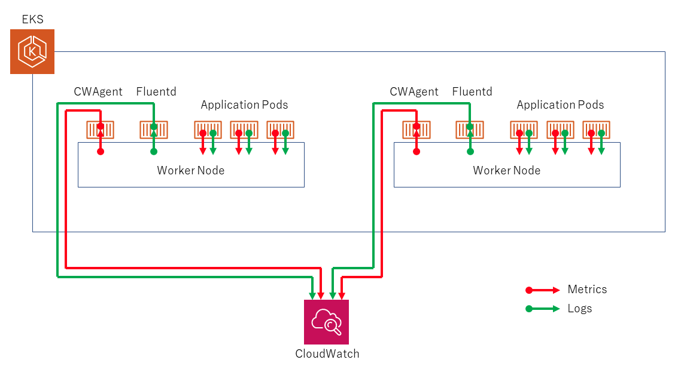

# Observability in the EKS Cluster
Observability is the ability to understand the internal state of a system based on its external outputs. In other words, it is the ability to see what is happening inside a system without having to open it up and look directly at the components.

In AWS, the solution to collect, aggregate and summarize metrics and logs from our containerized applications and microservices is the CloudWatch Container Insights.

CloudWatch automatically collects metrics for many resources - CPU, disk, memory and network. Contsiner Insights also provides diagnostic information, such as container restart failures, to help the user isolate and resolve them quickly.

CloudWatch alarms can be set on metrics that Container Insights collects.


## Installing Observability Tools
In the EKS cluster, we will install **CloudWatch Agent** to collect metrics of the cluster and **Fluent-Bit** to route logs to CloudWatch Logs using a DaemonSet.



For the EKS Cluster, we already allowed permissions for CloudWatch to peer into the cluster for data.

1. Create a namespace `amazon-cloudwatch` using the following command:
```bash
kubectl create ns amazon-cloudwatch
```
- ascertain the namespace is present by running:
```bash
# result should contain amazon-cloudwatch
kubectl get ns
```

2. Specify some settings values, and after install CloudWatch Agent and Fluent Bit. Copy and paste these one at a time.
```bash
ClusterName=eks-demo
RegionName=$AWS_REGION
FluentBitHttpPort='2020'
FluentBitReadFromHead='Off'
[[ ${FluentBitReadFromHead} = 'On' ]] && FluentBitReadFromTail='Off'|| FluentBitReadFromTail='On'
[[ -z ${FluentBitHttpPort} ]] && FluentBitHttpServer='Off' || FluentBitHttpServer='On'
```
- download the cwagent-fluent-bit DaemonSet manifes with this command:
```bash
wget https://raw.githubusercontent.com/aws-samples/amazon-cloudwatch-container-insights/latest/k8s-deployment-manifest-templates/deployment-mode/daemonset/container-insights-monitoring/quickstart/cwagent-fluent-bit-quickstart.yaml
```
- apply the environment variables already set into this manifest file
```bash
sed -i 's/{{cluster_name}}/'${ClusterName}'/;s/{{region_name}}/'${RegionName}'/;s/{{http_server_toggle}}/"'${FluentBitHttpServer}'"/;s/{{http_server_port}}/"'${FluentBitHttpPort}'"/;s/{{read_from_head}}/"'${FluentBitReadFromHead}'"/;s/{{read_from_tail}}/"'${FluentBitReadFromTail}'"/' cwagent-fluent-bit-quickstart.yaml 
```
- open the DaemonSet object which has the fluent-bit name and add the following code below the spec, mind the indentation:
```bash
affinity:
  nodeAffinity:
    requiredDuringSchedulingIgnoredDuringExecution:
      nodeSelectorTerms:
      - matchExpressions:
        - key: eks.amazonaws.com/compute-type
          operator: NotIn
          values:
          - fargate
```
- deploy the manifest file
```bash
kubectl apply -f cwagent-fluent-bit-quickstart.yaml
```

3. Check whether the installation has succeeded. The result should be 3 each of cloudwatch-agents and fluent-bit pods.
```bash
kubectl get po -n amazon-cloudwatch
```
- we can also check it via the DaemonSets output
```bash
kubectl get daemonsets -n amazon-cloudwatch
```


## Observing in the CloudWatch Console
1. Go to Amazon CloudWatch console > Insights > Container Insights > Resources > search eks-demo.
2. Click on **Map View** in upper-right corner. Tree view will be enabled. Click on object to see associated metric values.
3. Select Performance Monitoring (in select bar) > Click EKS Services > eks-demo. The metric values in terms of Services are shown here.
4. Select Pod Performance > Select a Pod (flask-backend) > Actions > View Performance Logs
5. There will be a redirection to CloudWatch Logs Insight. Add this particular query to get the logs we want:
```bash
fields @timestamp, @log, @logStream, @message
| filter ispresent(kubernetes.pod_name) and kubernetes.pod_name like /demo-flask-backend-{add the ID}/
| sort @timestamp desc
| limit 50
```