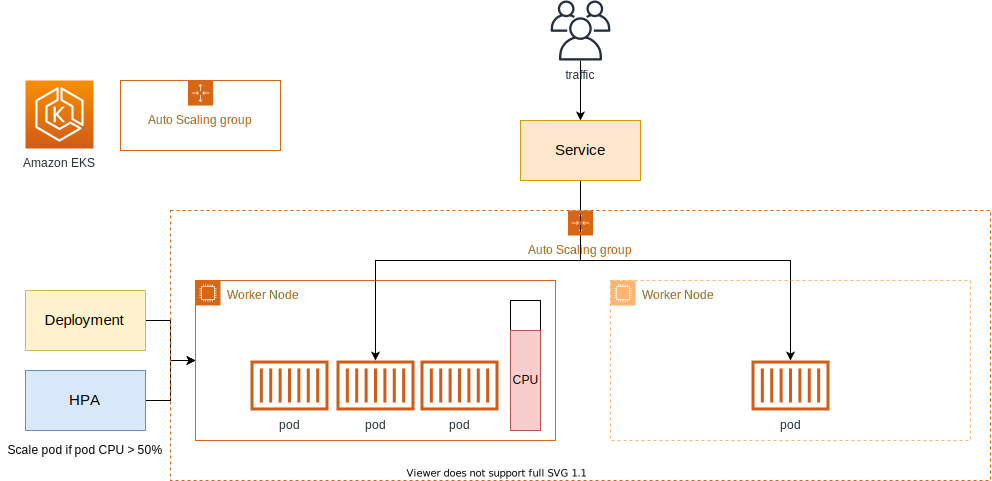

# AutoScaling Pods and EKS Cluster
Autoscaling means the ability to provision and/or delete resources as per a set of user-defined cycle or events. Basically, resources are provisoned or destroyed per a set of rules given/issued by a user/controller.

In Kubernetes, there are two ways to factor in autoscaling: 
1. using a Horizontal Pod Autoscaler (HPA)
2. using a Cluster Autoscaler (CA)

Here is a table showing how they work in Kubernetes:
| Feature       | Horizontal Pod Autoscaler                                                                      | Cluster Autoscaler                                                               |
|---------------|--------------------------------------------------------------------------|------------------------------------------------------------------|
| Level         | Pod                                                                      | Cluster                                                          |
| Scaled metric | CPU utilization, memory utilization, or custom metrics                   | Number of pending pods and availability of resources             |
| Goal          | Ensure that applications have the resources they need to run effectively | Ensure that the cluster has enough nodes to run all pending pods |

With the application of these capabilities, we can build resilient and scalable Kubernetes environment.


## Pod Scaling with Horizontal Pod AutoScaler
From the above table, we can see that HPA depends on Pod information - like metrics in order to kickstart its work. For Pod scaling to work, we must redefine our Deployment file to contain resource limits. With the introduction of these conditions, scaling can be done through HPA.


1. Apply the Kubernetes Metrics Server object. The Metrics Server collects and aggregates reosurce usage data across the Kubernetes cluster. The kubelet on each node collects metrics - CPU, memory - of both the node and Pods running on it.
- install the Metrics Server with this command:
```bash
kubectl apply -f https://github.com/kubernetes-sigs/metrics-server/releases/latest/download/components.yaml
```

2. Check whether the Metrics Server is created succesfully. Use this command:
```bash
kubectl get deployment metrics-server -n kube-system
```

3. Modify the `flask-deployment.yaml` file in /05-microservices/backend-one-manifests directory. Change the replicas to 1 and add resource limits.
- use the template in `flask-deployment.yaml` file in this directory. Note that we only created limits for CPU usage only.
- apply the changes
```bash
kubectl apply -f flask-deployment.yaml
```

4. Now we create the Horizontal Pod Autoscaler manifest file that targets the flask-deployment. We set the minimum and maximum number of replicas that it can have. More importantly, we specify the metric at which there should be an increment in replica count.
- the template is in the `flask-hpa.yaml` manifest file.
- apply the manifest with the command:
```bash
kubectl apply -f flask-hpa.yaml
```
- an imperative way of doing all these will be to run this command:
```bash
kubectl autoscale deployment demo-flask-backend --cpu-percent=30 --min=1 --max=5
```

5. Check on the status of the HPA, it takes some time for the status of the resources to come up though. Spam this command to check.
```bash
kubectl get hpa
```

6. We now perform a load test to verify the autoscaling functionality is working properly.
- use this command to understrand the amount of change in the Pod
```bash
kubectl get hpa -w
```
- in an adjoining terminal, install the `siege` tool to conduct HTTP load testing.
```bash
sudo yum -y install seige

# get ingress to flask backend
export flask_api=$(kubectl get ingress/flask-backend-ingress -o jsonpath='{.status.loadBalancer.ingress[*].hostname}')/contents/aws

# The -c 200 option tells siege to generate 200 concurrent connections to the Flask API. 
# The -i http://$flask_api option tells siege to send HTTP requests to the Flask API.
siege -c 200 -i http://$flask_api
```

With the adjoining terminal open with the `hpa -w` command running, we can see the replica count ajusting to cater for the load the flask-backend is dealing with.


## Installing the Kubernetes Operational View
The Kubernetes Operational View is a simple web page that provides a visual view of the health of multiple Kubernetes clusters. It is not used for monitoring and operations management purposes, but it can be used to visually observe the process of scaling in/out during cluster autoscaling operations - with the Cluster Autoscaler.

1. Install Helm
```bash
curl https://raw.githubusercontent.com/helm/helm/master/scripts/get-helm-3 | bash
```
- check the version of helm
```bash
helm version --short
```

2. Use the command to add a stable repository
```bash
# add a stable repo
helm repo add stable https://charts.helm.sh/stable

helm repo add k8s-at-home https://k8s-at-home.com/charts/

# update the repo
helm repo update
```

3. Install the kube-ops-view tool
```bash
helm install kube-ops-view k8s-at-home/kube-ops-view
```
- check if the chart was successfully installed
```bash
helm list
```

4. Get the kube-ops-view Pod URL by running these commands:
```bash
export POD_NAME=$(kubectl get pods --namespace default -l "app.kubernetes.io/name=kube-ops-view,app.kubernetes.io/instance=kube-ops-view" -o jsonpath="{.items[0].metadata.name}")
```
- get the Pod name
```bash
echo $POD_NAME
```
- Port-forward the application to get the Preview page
```bash
kubectl port-forward $POD_NAME 8080:8080
```


## Cluster Scaling with Cluster Autoscaler
At a point, if there is consistently increasing traffic, the Pods cannot be scheduled on nodes due to insufficient resources available. At that point, the next thing to do is to add more nodes. We can automatically set this to happen by using the Cluster Autoscaler.

Cluster AutoScaler Arch:



The Cluster Autoscaler when present is triggered when a Pod in a 'Pending' state is present. It performs scaling in/out by checking the CPU Utilization of the node. In here, the AWS AutoScaling Group feature powers the Cluster Autoscaler.

- NB: In the creation of the EKS cluster, we have already allowed Autoscaling via IAM policy permissions.

1. Check the value of the AutoScaling Group attached to the current cluster's worker nodes with this command:
```bash
aws autoscaling \
  describe-auto-scaling-groups \
  --query "AutoScalingGroups[? Tags[? (Key=='eks:cluster-name') && Value=='eks-demo']].[AutoScalingGroupName, MinSize, MaxSize,DesiredCapacity]" \
  --output table
```

2. Go to the AWS EC2 Console > Click AutoScaling Groups > Click on the eks clsuster > Go to Details > Edit Details > Update the value of Maximun Capacity to 5.

3. In the Development environment, download the deployment file provided by the Cluster AutoScaler project.
```bash
wget https://raw.githubusercontent.com/kubernetes/autoscaler/master/cluster-autoscaler/cloudprovider/aws/examples/cluster-autoscaler-autodiscover.yaml
```

4. Open the downloaded YAML manifest file and set the cluster name to `eks-demo` adn deploy it
- it should look something like this:
```bash
...          
        command:
            - ./cluster-autoscaler
            - --v=4
            - --stderrthreshold=info
            - --cloud-provider=aws
            - --skip-nodes-with-local-storage=false
            - --expander=least-waste
            - --node-group-auto-discovery=asg:tag=k8s.io/cluster-autoscaler/enabled,k8s.io/cluster-autoscaler/eks-demo
...
```
- deploy with this:
```bash
kubectl apply -f cluster-autoscaler-autodiscover.yaml
```

5. Perform a simple load test to check that the autoscaling functionality is working properly. First, enter the command below to understand the change in the number of worker nodes.
```bash
kubectl get nodes -w
```
- Then turn on the new terminal, and then perform a command to deploy 100 pods to increase the worker node.
```bash
kubectl create deployment autoscaler-demo --image=nginx
kubectl scale deployment autoscaler-demo --replicas=100
```
- To check the progress of the pod's deployment, perform the following command.
```bash
kubectl get deployment autoscaler-demo --watch
```

6. Navigate to the URL used by kube-ops-view to view thw number of nodes and Pods scheduled now. The number of nodes should have increased.