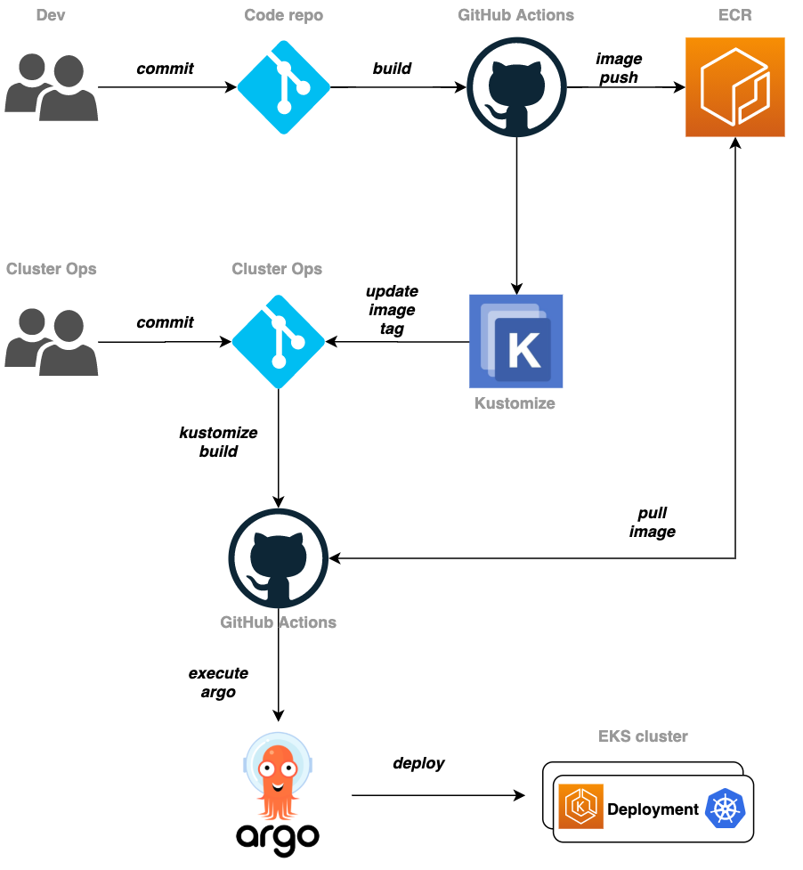

# CI/CD Pipeline for EKS Cluster
CI and CD are the dreaded terms every DevOps engineer has grown to love (and hate, I admit sometimes) that mainly define (in some DevOps definitions) what the work of a DevOps engineer is.

With Continuous Integration, code is continuously updated and stored so that it can easily be ported over for use in a system. Continuous Delivery/Deployment takes care of taking the stored code and putting it into a system where it is used.

In this session, we will develop a CI/CD pipeline solution using open-source tooling and another pipeline that uses AWS services/alternatives for these open-source tooling. We will add static code analysis, thereby sprinkiling some DevSecOps into the mix.

## Open-Source Tooling CI/CD Pipeline
This CI/CD pipeline will help will have the following:
- automatic detection of code changes using Git with GitHub
- triggering, building and integrating the code changes using GitHub Actions
- packaging of Kubernetes YAML manifest files with Kustomize
- delivery of Kubernetes YAML manifest file to the EKS cluster with ArgoCD.

They flow of this pipeline is modelled after a concept known as GitOps. In my opinion, GitOps is basically the versioning of all code using a Git-like tool.



To commence the building of this pipeline, we will use a multi-repo format. In this format, we separate the frontend code to build from the Kubernetes manifest files.

### Frontend Code Repo
1. Create a repo for the frontend application and populate it with code from the `05-microservices/frontend-manifests/amazon-eks-frontend` subdirectory.

2. Prepare a least-privilege IAM role to use for CI/CD pipeline.

As already stated, GitHub Actions is the CI tool we are using to build the application, build its container image and push it to Amazon ECR. We need to give Amazon ECR permissions to access ECR only so we create an IAM role (of least privilege) that limits GitHub Actions to Amazon ECR only.

- create a GitHub Actions IAM user
```bash
aws iam create-user --user-name github-actions
```
- create least privilege policy with ECR permissions only in an `ecr-policy.json` file.
- create an IAM policy from the `ecr-policy.json` file, with name, ecr-policy.
```bash
aws iam create-policy --policy-name ecr-policy --policy-document file://ecr-policy.json
```
- attach the ecr-policy to the github-actions user
```bash
aws iam attach-user-policy --user-name github-actions --policy-arn arn:aws:iam::${AWS_ACCOUNT_ID}:policy/ecr-policy
```

3. Create GitHub Secrets with AWS Credentials and GitHub Access Token.

GitHub Actions will need to have access our AWS Account in order to use the Amazon ECR repo, it will also need access to our GitHub Account in order to check out code. So we will need to create and store AWS Credentials and GitHub Access tokens as secrets it can use to perform these functions.

- generate AWS Credentials. If you already have 2 active credentials in your AW Account, I suggest you remove the one you are currently not using (It's time for rotation anyways). In my case, I have credentials for Gitpod and another CLI. I will remove the credentials for my other CLI access and use that spot for GitHub Actions.
- I recommend going to the AWS Console to generate these, copy and save the SecretAccessKey and AccessKeyID
```bash
aws iam create-access-key --user-name github-actions
```

- generate a GitHub personal access token. Go to Github, navigate to Profile > Settings > Developer Settings > Personal Access Tokens. Click on Generate New Token, give the token a suitable name (`access token for github actions`). Select repo in Select Scopes and finally click Generate Token. Copy and Save value of Personal Access Token.

- Create GitHub Secrets. Go to the repo for the frontend application and navigate to Settings > Secrets. Click on New Repository Secret. Create the following secrets:
  - GitHub personal access token with name `GITHUB_TOKEN` and value
  - AWS secret access key with name `AWS_SECRET_ACCESS_KEY` and value
  - AWS access key ID with name `AWS_ACCESS_KEY_ID` and value

4. Create build script for GitHub Actions
- make a `.github/workflows` directory in the frontend repo
- write a `build.yaml` file athat GitHub Actions will use to perform Continuous Integration functions for us ie. checkout, build, create Docker image and push to ECR. We introduce dynamic image tagging for the Docker images created.
- after adding the build steps file, push the code to GitHub and the GitHub Actions workflow will be triggered and the workflow run step-by-step based on the build steps.
- after it has concluded, check the Amazon ECR repo to find a new image with a tag that is part of the SHA value of the GitHub commit.


### Kubernetes Manifest Repo
Kustomize in this use-case is a tool that is used to modify Kubernetes manifest files on-the-fly, no manual modification needed. We will use it to also dynamically tag Kubernetes deployments.

1. Create an entire repo for the Kubernetes manifest files that we will inject into the EKS Cluster environment. These files will be packaged to be deployed using Kustomize. Create the directories `k8s-manifest-repo/base` and `k8s-manifest-repo/overlays/dev/`.
- the `base` contains the raw and newly updated (from the iterations done) Kubernetes manifest files. The content in here will be customized with Kustomize using a `kustomize.yaml` file.
- the `overlays` will contain content to be used to customize the base Kubernetes YAML manifests. The `dev` is to signify that we are deploying to e dev environment.

2. The goal is to make a deployment pipeline for the frontend application. Hence, we will use Kustomize to edit the YAMl manifest values in the `frontend-deployment.yaml` and `frontend-service.yaml` files.\
- make a `kustomize.yaml` file in the `base` directory. This will be to define the target files to be automatically injected into by Kustomize.
- write patch files that contain values that Kustomize will inject into the files specified by the `kustomize.yaml` file. These patch files should be in the `overlays/dev` directory.
- write a `kustomization.yaml` file that will run and perform the change injections needed to apply the patches, change a few names in the frontend Deployment YAMl files. This should be placed inthe `overlay/dev` directory. The change in values wil automatically happen on deployment to the EKS cluster.


### Set Up ArgoCD Cluster
1. Install ArgoCD in the EKS cluster. Run the following code to do so:
```bash
kubectl create namespace argocd
kubectl apply -n argocd -f https://raw.githubusercontent.com/argoproj/argo-cd/stable/manifests/install.yaml
```
- the ArgoCD object is not automatically exposed to be accessed outside of the cluster, we have to set up the AWS ELB to route traffic to it. The command below is used to make this happen:
```bash
kubectl patch svc argocd-server -n argocd -p '{"spec": {"type": "LoadBalancer"}}'
```
- it takes some time for the Loadbalancer to be activated for the ArgoCD service object. Run this code to get the URL of the ELB provisioned
```bash
export ARGOCD_SERVER=`kubectl get svc argocd-server -n argocd -o json | jq --raw-output .status.loadBalancer.ingress[0].hostname`
echo $ARGOCD_SERVER
```
- to get into the ArgoCD UI, we need a password and a username. The username is `admin` but the password can be gotten by running this command:
```bash
ARGO_PWD=`kubectl -n argocd get secret argocd-initial-admin-secret -o jsonpath="{.data.password}" | base64 -d`
echo $ARGO_PWD
```
- the ArgoCD UI is available via the External IP of the argocd-server service object.

2. Configure an application in ArgoCD, use the name `eks-cd-pipeline` and the Project should be the `default` project.
- Go to Settings > Repositories > Connect Repo > Via HTTPS. Enter the https address to the Git repo containing the K8s manifest files and verify the connection.
- Go to Applications > Add New Application > Configure the Repo URL, Revision and Path to be the actual repo URL, the branch, `main`, and the path to be `overlays/dev`.
- Configure the Destination to be the default EKS cluster and the namespace to be default.
- We can set the SYNC to be either automatic or manual.

3. Add Kustomize step in the build.yaml file for GitHub Actions
- The addition of these steps will ensure that the code will update the container image tags in the Kubernetes manifest files using Kustomize, then it will commit and push these files to the Kubernetes manifest files repo.
- after adding and committing the code into the Kubernetes manifest Git repo, commit the `build.yaml` file into the frontend application repo and check on the GitHub Actions workflow.
- if it works fine, we then go into the ArgoCD UI and Sync the status of the application. ArgoCD will then start the deployment of the YAML manifests. A new thing about the frontend manifest is that, the image-tag used on the container will be changed.
- after the deployment has completed, we can hit the application URL with the result of this command:
```bash
echo http://$(kubectl get ingress/frontend-ingress -o jsonpath='{.status.loadBalancer.ingress[*].hostname}')
```
- also the GitHub Actions workflow will cause code to be committed into the Kubernetes manifet file repo. We can check in the K8s manifest file repo for thi confirmation.
- We can change code in the frontend application and re-commit it to run the pipeline and trigger the deployment once again.


## Creating A Secure CI/CD Pipeline - DevSecOps Practices
To improve security in the CI/CD pipeline already created and before deploying manifest files to the EKS cluster, we will make use of the tools - Checkov and Trivy. We will also create a separate user in the ArgoCD - this will help to secure ArgoCD and the EKS cluster.

With the introduction of these new tools, the CD process will look somewhat like this:
1. on changing frontend application code, a new docker image is created and tagged
2. the Trivy scans for vulnerabilities in the new image
3. the Kustomize tool creates new k8s manifests with the new image information
4. the Checkov tool inspects vulnerabilities and configuration of k8s manifest files
5. ArgoCD syncs jobs and starts to deploy manifest files.

There will now be two GitHub workflow files; one in the frontend application repo and one in the K8s manifest repo.

- NB: For deployments with ArgoCD to the EKS cluster, we will do the following:
  - deactivate auto syncing
  - create a new ArgoCD account & create an auth-token for new account
  - configure RBAC policies for new ArgoCD account

### Create GitHub Actions Workflow Script in K8s Manifest Repo
1. create a `.github/workflows` repo in the K8s manifest repo. Populate it with code from the `secops-practices/k8s-build.yaml` file.
- the K8s code will be checked out and set up.
- Kustomize will apply the changes that we have specified to the root YAML manifest files.
- the Checkov tool will run and cross-check the K8s configuration.
- then, we install ArgoCD, sync it with our already existing `eks-cd-pipeline` application, with an authentication token.